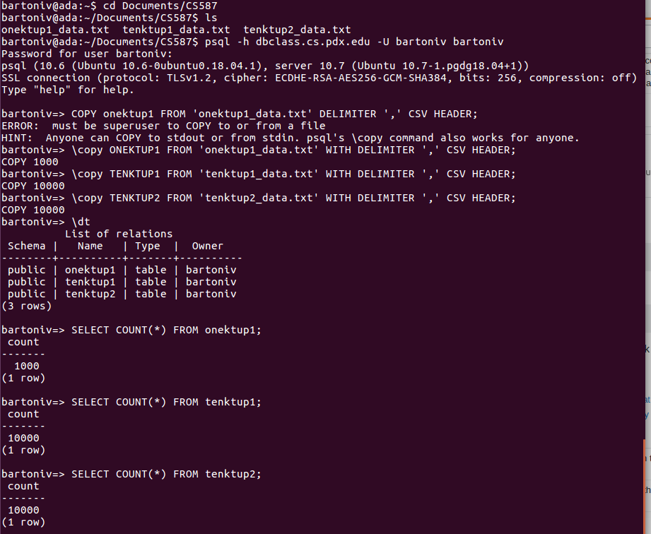
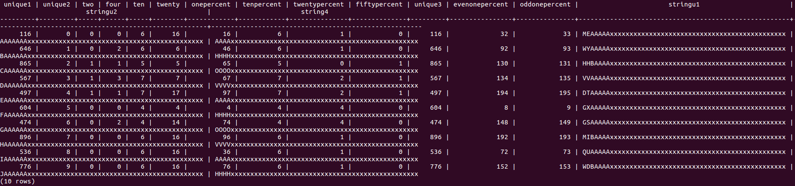

# Project - Part 1

## Overview
The goal of this part of the project was to setup the GitHub repository, create scripts to generate data according the specification in the Wisconsin Benchmark paper, and then load some amount of data into the DBMS chosen. The repo design is explained in the [README](../README.md) file in the root of this project and the other two sections are explained below.

## Data Generation Scripts
To start, this project was done in Javascript due to my personal comfort with the language, my usage of it in the previous database project in CS 586, and past experience starting a Node JS project. To generate data, I created two files. First, `random_generation.js` serves as a utilities files that contains methods to return a random value from an array and also convert an integer into a specific string format as defined in the Wisconsin Benchmark. The former method is designed that way because I opted to do a simple process of creating an array of all values from 0 - (MAXTUPLES-1) and then continuosly picking a random value from it (removing the selected value to ensure uniqueness upon multiple random accesses) in order to generate the "unique" value for each code. While it's probably not as efficient as the example code in the Benchmark paper, I preferred it because it was a process I understood more easily and didn't take exceedingly long based on personal experimentation (roughly 15 seconds to generate 10 million rows of data) For the second method to create a unique string, it's worth noting that this code does parrot the design of the C++ code of the `convert` example function in the paper (DeWitt 9), but I tweaked it into something that is more streamlined and accounts for the issues that were noted in class discussions.

The other script file I created is `main.js` which holds the majority of the data generation process. It simply creates an array of values from 0 - (MAXTUPLES-1), repeatedly picks and removes a unique value from it, then generates a series of values according to the Benchmark standard (DeWitt 8-9). Each row is then written to a text file as a common seperated string to essentially generate a CSV file. From there, the CSV can be loaded into the DBMS quite easily. 

## Data Loading
The next part of the project was to load the generated data into a database. I opted for a Postgres database which I chose because I have work experience with Postgres and `psql` and also I was under the impression that most people would be using Google Cloud Platform/BigQuery so I went with Postgres for something different. To generate the tables for the project, I used the general table structure identified in the benchmark paper (DeWitt 5) which I also saved into the `create_table.sql` SQL file in the `data` folder. The only change was the table names, which were `onektup1`, `tenktup1` and `tenktup2`. I realize that we may be extending this to create tables with more tuples, but given that the goal was simply to load some data I opted for this baseline standard. To actual load the data, I ran my data generation script for 1000 and 10000 tuples (twice) and saved the corresponding text files. From there, `psql` provides a nifty way to load CSV files (or text files saved as CSVs) into tables. Thi process can be seen in the following picture via the command line output:

As noted with the `COPY 1000` and `COPY 10000` plus the results of the `SELECT COUNT(*)` queries for each of the tables, the correct number of rows was added. To demonstrate that actual data was loaded, I ran the query `SELECT * FROM onektup1 WHERE unique2 < 10` to output the first 10 rows from the CSV. The results (although not ideally formatted due to the minimal window size of my terminal prompt) are provided in the following image and can be cross-referenced with the data in the `data/onektup1_data.txt` to verify that the proper rows were added:

Finally, since part of the project requires so sample data, the exact data files I copied into my database relations can be found in the `data` folder with appropriate names.

## Lessons Learned
First, I really appreciated how efficient this process ended up being. The first representation of this is with data generation - I was worried that my simple process of randomly selecting a value from an array of unique values would be slow, but I was able to generate up to 10 million values with no more than 15-20 seconds and the needed values of 1000 to 10000 rows in less than 5 seconds. The second thing I appreciated was how easy it was to load the data into the relation from a CSV file. The `\copy` command in `psql` is not something I had used before but it took me just 10 minutes to understand the syntax and properly load everything.

That being said, there are some thing I noticed that will require adjustments. The major impact is interacting with the database through the command prompt. While `psql` is nice and you can do a lot, the data presentation in a terminal window is not ideal (as noted in the second image in the [Data Loading](#Data-Loading)). I think we might have to implement a data visualization method in a future part of this project, but also having a tool like PGAdmin of something else that can connect to my remote DB would be great. Another issue I experienced with the remote connection is that I was having trouble connecting from my local Ubuntu instance (that has Postgres installed). I believe it was a configuration problem based on past work I've done, but the result was that I opted to `ssh` into my profile at the `linux.cs.pdx.edu` host and then run then remotely connect to my database from there. This worked fine, but since my working directory is on my local machine I was having to ship text files and other data items to the `linux.cs.pdx.edu` host before copying them to the remote db connection. This inefficiency is something I hope to address, either by doing more work on my `linux.cs.pdx.edu` host or figuring out the connection issue that is preventing me from connecting directly the the remote db from my local system.

## Works Cited
DeWitt, David J. "The Wisconsin Benchmark: Past, Present, and Future." *Computer Science Department, University of Wisconsin*, p. 1-43.
